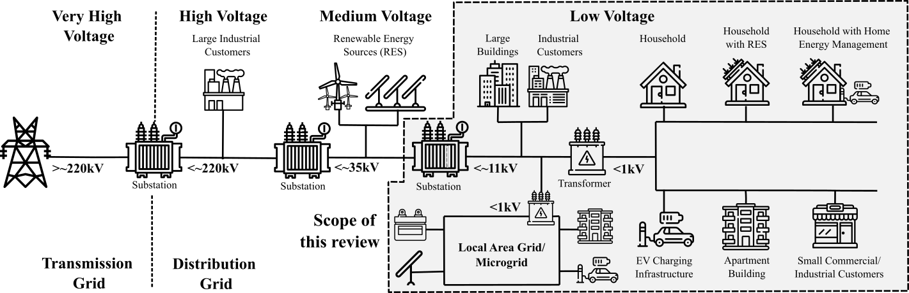

<!-- # Lessons from a review of low-voltage load forecasting
Challenges and Recommendations -->

Many projects and new hobbies started during the lockdowns over the past year and half. I was lucky enough to be evolved in a project with my very good colleagues, Stephen Haben, Siddharth Arora, Danica Vukadinović Greetham and Marcus Voss. (preprint version on [arxiv.org](https://arxiv.org/abs/2106.00006) and published version on [Applied Energy](https://www.sciencedirect.com/science/article/abs/pii/S0306261921011326))

Steve invited us to review the literature of low-voltage load forecasting. You might wonder why we care about this. We ‘ve been active in the field of low-voltage (LV) modelling for several years and we witnessed it growing from its very early days. Also, the timing could not be better for such a review. The need for decarbonisation of the energy market has challenged the current practices followed by the energy operators. The fast spread of smart and low-carbon technologies, such as smart metering, photovoltaics, electric vehicles, home and feeder batteries, to name a few, are changing electricity consumption patterns causing a paradigm shift for the energy operators. Local electricity networks, such as low-voltage networks, will not only consume, but also produce energy (through, for example, solar panels), which will require advanced control and management. Until now, there has not yet been an extensive investigation into the current state-of-the-art of low voltage level forecasts, other than at the smart meter level. As a results, we decided that a review will serve as a practical guide to LV modelling community.

## What is a low-voltage network?
Low voltage is a relative term and is defined differently in different countries. The following figure gives a simplified overview of the layout of electrical grids, as they are typical, for instance, in the UK and Europe. The voltages are stepped down via several substations from the very high transmission level down to the end-customer level.

| |
|:--:|
|Fig. Overview of typical high, medium and low voltage grid layout. This shaded area shows the scope of our review. Figure taken from the [“Review of low voltage load forecasting: Methods, applications, and recommendations”](https://www.sciencedirect.com/science/article/abs/pii/S0306261921011326) and its [preprint version](https://arxiv.org/abs/2106.00006).|

For the scope of our review, the low-voltage definition extends from voltage level of 11kV in the UK and 10kV in Europe, down to the end-customer level. This ensures that the review remains focused on the challenging area of the “last mile” of the distribution network with its numerous applications, heterogeneous end-customers, such as EV charging stations, households, small businesses, buildings, etc., and relatively high volatility. The scope further retains forecasting within local area grids and microgrids that are operated at low voltages, as well as the special case of the household level.

## Divide and Conquer
Our search for relevant literature started from [Scopus](https://www.scopus.com/), an abstract and citation database that provides a user-friendly interface for refining and investigating our queries. Our first query returned 1,487 manuscripts and we observed a proliferation of papers and increasing trend post-2000.

We first split the papers into conference and journal publications. For the journal publications, we kept papers prior to 2019 with five or more citations, as a proxy to impactful methods, and all papers in 2019 and 2020, resulting to 423 papers. For the conference papers we were slightly stricter and kept only those with more than 20 citations while retaining all of those from 2020 resulting in 69 conference papers. In total, this resulted in 492 articles.

After a high-level investigation of these papers, we discarded many which were not about low voltage level load forecasting, or could not be accessed because they were behind paywalls and could not be accessed by any others sources (including contacting the authors), or were not available in English. This resulted to a final list of 221 papers, which were equally split among the authors.

## Methods & Applications
A number of interesting methods have been proposed by the community in terms of algorithms, features and applications. A full review of these methods is beyond the scope of this blog-post, but it is worth mentioning that the forecasting algorithms reviewed can be split into the following broad categories:
  - *Statistical and time series*, such as linear regression, autoregressive (AR) and moving average (MA) their combinations and extensions, exponential smoothing (such as the Holt-Winter-Tayler method), and many other.
  - *Machine learning*, such as nearest neighbours, regression trees, support vector regression, Gaussian process, feed-forward artificial neural networks (NN), Bayesian NN, to name a few among a long list.
  - *Deep NN*, such as Long Short-term Memory, convolutional NN and their combination (e.g. auto-encoders for Feature Representation).
  - *Hybrid, combination and ensemble approaches*, such random forests and gradient boosting. Also, it was common that several authors developed more than one forecast and took the weighted average (combination) of two or more methods, which is shown to have better performance than the individual forecasts.
  - *Probabilistic forecasting methods*, such as prediction intervals, quantile regression and kernel density approaches.

Other *trends* in the LV forecasting community include the forecasting of the peak demand, forecast evaluation (developing robust error measures), split the demand into components to improve prediction accuracy, or clustering (commonly using k-means) of similar customers for scalability and performance improvement.

LV forecasts are often used within specific *applications*, which require estimates for planning, operation and trading.
  - *Network design and planning*. Forecasts are often used in grid design optimisation, e.g. minimising the costs of locating and sizing capacitors on the distribution network.
  - *Control and Management*. A forecast is used to help control a storage device and optimally operational planning, reduce peak load and control electric vehicle charging.
  - *Anomaly detection*. Several papers used forecasts to identify anomalies, with main applications being theft detection, to reduce malicious attacks, and develop warning systems for peak electricity demand.
  - *Trading*. The use of locally generated energy is expected to play a significant role in future local grids. Trading the excess of energy requires very accurate forecasts of the LV network.
  - *Missing data and privacy protection*. Several authors used forecasts to estimate missing data, while others studied the effects of missing data on the forecast accuracy. Finally, methods are developed to protect household privacy whilst preserving load profile correlations between forecasts and actuals.

## Datasets
Of the 221 articles we reviewed, only 52 use at least one publicly available dataset. We find that the low percentage of open-source datasets is potentially problematic for the field, we give our recommendations in the next section.
A major contribution of our review is the collection of the open-source datasets that we encountered into an online catalogue, please check this [website](https://low-voltage-loadforecasting.github.io/) for more details (special credits must go to Marcus for the development of the site).

> We aim to keep this webpage updated with new datasets that become available and we urge the community to submit their datasets via PRs.

## Practices and Recommendations
During the review, we noticed a number of poor practices and we hope our recommendations will help the LV forecasting community to improve.
  1. *Tackling single-source data bias* — The vast majority of the literature utilised a single data-source, the Irish CER dataset, potentially because it was one of the first open-source repositories of such a dataset. As a result, many of the methods and insights might be biased to the characteristics of this dataset. To better gauge the practical scalability of models and the generalizability of findings reported using the Irish CER data, external validation using other datasets is needed.
  2. *Clarity in problem definition* — During the review, we found that many papers did not have a clear definition of the problem, i.e. lack of clarity on the data and forecast characteristics, e.g. the time-series resolution, the forecast horizon, forecasting scheme, level of aggregation, error measures and pre-processing steps. The authors should clearly define the problem at hand and lay-out the forecasting strategy. Reproducibility of the results is crucial for a fair assessment and comparison of the different methodologies.
  3. *Need for benchmarks* — Numerous articles did not employ benchmarks to compare their models against (they typically compared different variants of their presented approach). A comparison to simple (e.g. average value of the same day and time of the last 4 weeks) or sophisticated (e.g. Holt-Winters-Taylor) benchmarks can show how much the increased complexity of the proposed model can improve the forecasting accuracy.
  4. *Use of Computational Intelligence Models* — The above point applies to computationally complex models too. There is a recent trend to use such models from the deep learning domain on all kinds of problems with abundant data. It is possible to pick novel algorithms and mechanisms, apply them to the LV load forecasting problem and with sufficient tuning achieve good performance on a test set. Given the above challenges (dataset bias and missing benchmarks), it is therefore hard to judge the contribution of a novel approach. Compared to statistical models, current computational models are generally less interpretable and computationally expensive, making them less attractive to industrial and commercial organisations, as they are more costly to run and less ecologically sustainable. Extending our recommendation for benchmarks, we also propose instead of comparing computational approaches only to other computational approaches or to simple benchmarks, novel deep learning approaches should be compared to strong statistical models like SARMA and HWT exponential smoothing.
  5. *Robust validation* — We also found that many articles lacked proper validation, i.e. splitting the data into training, validation and test sets. Very often hyper-parameter tuning was missing or hyper-parameters were chosen based on the test set, whereas a validation set should have been defined and be separate from the test set. The test dataset should be sufficiently large and representative.
  6. *Weather forecasts* — The vast majority of reviewed methods that used weather features used weather actuals rather than weather forecasts.. This results to an under-estimation of the forecast errors, because errors due to the forecasted weather variables have not been counted into the models. Weather ensemble predictions need to be used while modelling the LV load.
  7. *Probabilistic forecasts* — The LV load is considerably volatile. Despite their popularity, point-forecasts cannot capture the intrinsic volatility of the load. In contrast, the focus should be on the development of probabilistic forecasts, which are more informative than point-forecasts and suitable for decision making.
  8. *Improving access to literature and datasets* — Despite generally a trend towards more open research by using preprint servers and Open Access journals, currently, the majority of journals in this area are not Open Access. The same applies to datasets and code, where we noticed that a considerable proportion of papers used closed data sets and code was unavailable. More journals should allow the sharing of preprints. Regarding the datasets, the community should allow for open access of anonymised datasets. Code sharing is also crucial for reproducibility of the results. Open access version control tools, such as Github, are very popular in other communities, where collaborations are encouraged.
  9. *Applications* — For many applications, naïve forecast methods are used or an accurate forecast is assumed without much investigation into the impact of the forecast accuracy on the application. Often a forecasting method is not benchmarked at all, or worse still, no forecast is given. Although forecasting might not be the main subject of a paper, an (existing) forecast model must be utilised and the comparison to a benchmark must be presented. This will allow a proper assessment of the influence of forecast errors on the performance within the application.
  10. *Privacy* — one of the main obstacles to obtaining shared datasets from LV networks and households is data privacy, i.e. personal and life-style information can be deduced from the energy usage, and operational details for LV networks usually cannot be exposed due to safety or commercial reasons. Developing and evaluating methods for privacy protection in LV datasets will eventually enable opening and sharing (or at least modelling) of many more datasets.

## Summary
The literature review was an long but educative process through which we learnt a great deal of the state-of-the-art methods, current trends and practices.

> It should be noted that no individual method can currently be considered state-of-the-art in LV load forecasting, i.e. no method has been shown to consistently provide significantly improved results over any other method.

We also noticed some trends and common practices in the community and gave our recommendations for the improvements in the field and the community. Addressing the accessibility to articles, datasets and code is the top priority. Finally, we made a first step towards this direction by gathering all open-source datasets in this [webpage](https://low-voltage-loadforecasting.github.io/).

We truly hope that both beginners and experienced readers will enjoy, benefit from and contribute to this endeavour.
