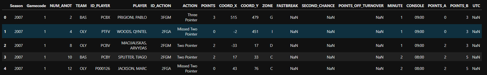
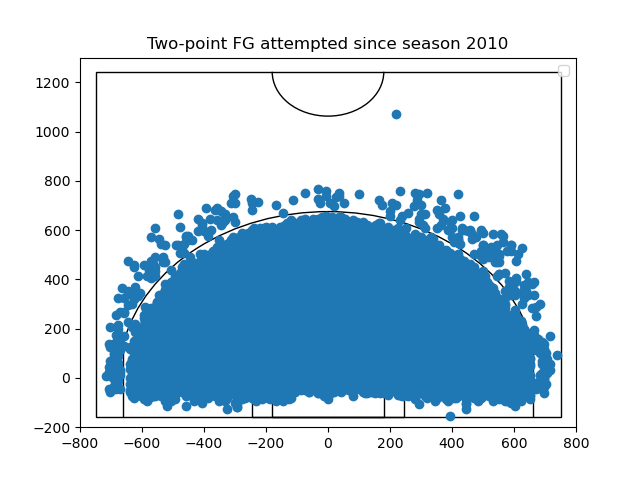
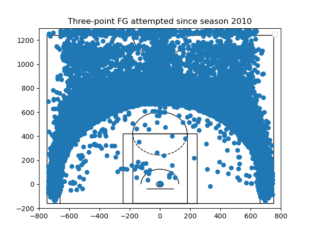
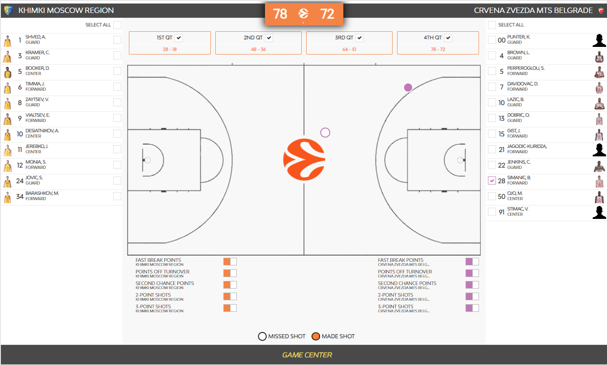

A recent controversy broke out in the game of Real Madrid against Virtus Bologna, where an extra point was suddenly added to Read Madrid's score, see [here](https://twitter.com/3StepsBasket/status/1585747489206173696) followed by errors in the game statistics, see also [here](https://twitter.com/3StepsBasket/status/1585968030240022528). These errors reminded errors and inconsistencies I had seen in the Euroleague's shot data a while ago when I was exploring the dataset.

I had never published these errors, so let's get into this once again. I am using data that is fetched from the official Euroleague API, see my [Medium blogpost](https://g-giasemidis.medium.com/create-euroleague-shot-charts-in-python-7ba4aa574644) for an introduction, code is available on [github](https://github.com/giasemidis/euroleague-shot-charts).

First, let's get familiar with the dataset. Here is a sample of the data.

The columns of interest are:

- *ID_ACTION*: an ID of the type of shot, with unique values being '2FGA', '2FGAB', '2FGM', '3FGA', '3FGAB', '3FGM', 'DUNK', 'FTM', 'LAYUPATT', 'LAYUPMD'.
- *ACTION*: the type of shot, with unique values being 'Dunk', 'Free Throw In', 'Layup Made', 'Missed Layup', 'Missed Three Pointer', 'Missed Two Pointer', 'Three Pointer', 'Two Pointer'.
- *COORD_X*: The x-coordinate of the court, the available values are extended from -740 to 746 units. Given that the width of a FIBA court is 15m, it should be extended from -750cm to 750cm when the basket is centred at x=0 and the units in the data must be cm.
- *COORD_Y*: The y-coordinate of the court, the available values are extended between -156 to 1304 units (very likely cm as above). The basketball hoop sits at coordinates (0, 0), negative values indicate behind the basket area. The minimum value, -156, is consistent, given that the basket is at 1.2m from the baseline and the basketball hoop has radius 46cm, i.e. 166cm available space behind the basket. Finally, the length of a FIBA half-court is 14m, meaning that the total available length in the data, (1304 + 156 = 1460cm), just extends the 14m length, because a few shots were taken from the other half of the court.
- *ΖΟΝΕ*: The zone on the court of the court, having unique values 'A', 'B', 'C', 'D', 'E', 'F', 'G', 'H', 'I', 'J'.

In another [blogpost](https://g-giasemidis.medium.com/create-euroleague-shot-charts-in-python-7ba4aa574644), I explained how to draw shot-data on a basketball court plot, focusing on made and missed shots or the density of total shots. Here, we are going to plot all shots by zone and then split between three-pointers, two-pointers, and the latter will further be split into at-rim and mid-range shots.

## Errors in data
I started by plotting two-point field goals (FG) attempts (including layups, dunks, etc.) and three-point fields goals attempts, see the next two figures. It becomes obvious that the location shot data is not consistent. Many shots tagged as three pointers are well inside the arc, many are even inside the paint area. And vice-versa, many shots tagged as two-pointers are outside the arc, particularly one shot is well outside.

| |
|:--:|
|Fig. 1: Two-point FGA since season 2010.|
| |
|:--:|
|Fig. 2: Three-point FGA since season 2010.|

I understand that the distinction shouldn't be made by visually comparing the location of the shot to the line of the arc. But, here there are clear inconsistencies independent of the location of the arc. Shots at similar location have been tagged differently, raising the concerns about the validity of the dataset.

I particularly investigated that long "two-pointer". According to the collected data, this shot is from the 2019-2020 season, the game of Khimki Moscow Region against Red Star Belgrade and was made by B. Simanic. We went to the official Euroleague site and found the game details, shooting-chart and play-by-play.

The [official shooting chart](https://www.euroleaguebasketball.net/euroleague/game-center/2019-20/khimki-moscow-region-crvena-zvezda-mts-belgrade/E2019/212/#shooting-chart) for B. Simanic from that game is shown below. It becomes obbious that the player had a missed and a made 3-point shots.

| |
|:--:|
|Fig. 2: Official Euroleague's shot chart of B. Simanic from the Khimki vs Red Star game in season 2019-2020.|

Then, I looked at the [official stat sheet](https://www.euroleaguebasketball.net/euroleague/game-center/2019-20/khimki-moscow-region-crvena-zvezda-mts-belgrade/E2019/212/#boxscore) from the game and the player has 0/1 2PT FG and 1/1 3PT FG. The missed shot, the long three pointer, is counted in the official stat as a 2 pointer. This is weird. I also looked at the official [play-by-play](https://www.euroleaguebasketball.net/euroleague/game-center/2019-20/khimki-moscow-region-crvena-zvezda-mts-belgrade/E2019/212/#play-by-play) and the shot taken at time 4:29 by Simanic is recorded as "Missed Two Pointer (0/1 - 0 pt)". This is the same time-stamp that the "long" two pointer has in my dataset too.

## Conclusion
So, the error is not an error in data processing or an error in the API. The official Euroleague data is recorded in an inconsistent way.

I would be interested in knowing the source of such systematic errors and how Euroleague will attempt to address them.

Once I find a systematic way to clean up the data in a way that doesn't bias the dataset, I will write-up about the mid-range and the three-point patterns in Euroleague.
